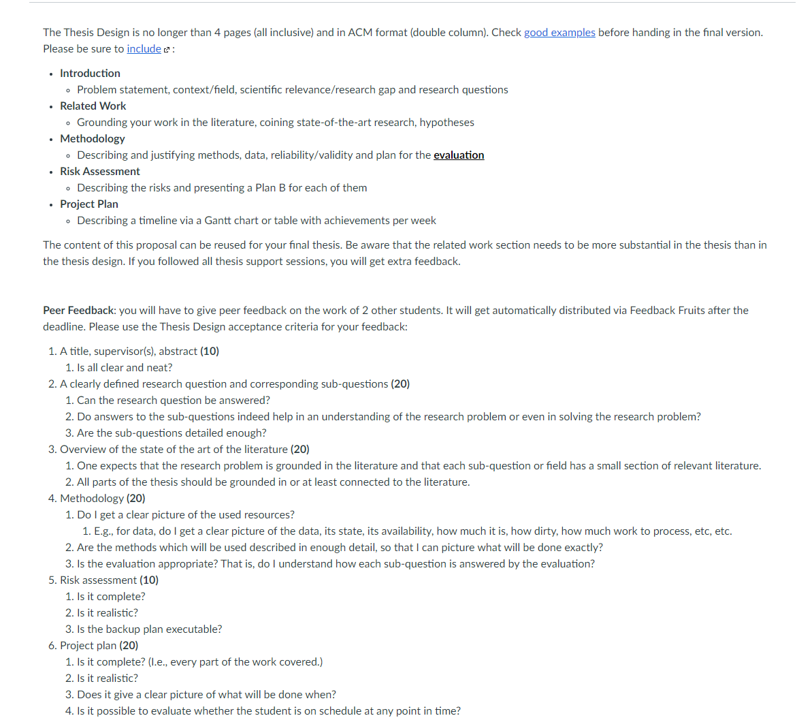

### Introduction
 * Introduce the general area of the research

### Problem Statement

 * What is the fundamental research problem that you aim to solve?
 * Why is the problem important?
 * Why is the problem non-trivial?
 * Why is the problem not solved by the current state-of-the-art

### Proposed Approach & Contributions
 * Sketch the method that you aim to develop to solve the outlined problem
 * List the novel contributions provided by your approach

### Example
 * Create an example, ideally with a figure, which exemplifies the problem and can be used to guide readers through your proposed approach

### Experimental Evaluation
 * How should the quality of your method be measured?
 * What are baseline techniques that your method should be compared to?
 * Sketch potential experiments and expected outcomes (on a high-level)

### Related Work
 * List the most important related work, ideally with a paper reference and a one-sentence description

### Open Questions
 * List open questions not covered by the proposal

### Next Steps
 * Describe what the immediate next steps for the proposed work should be

Here's an example of thesis design:

